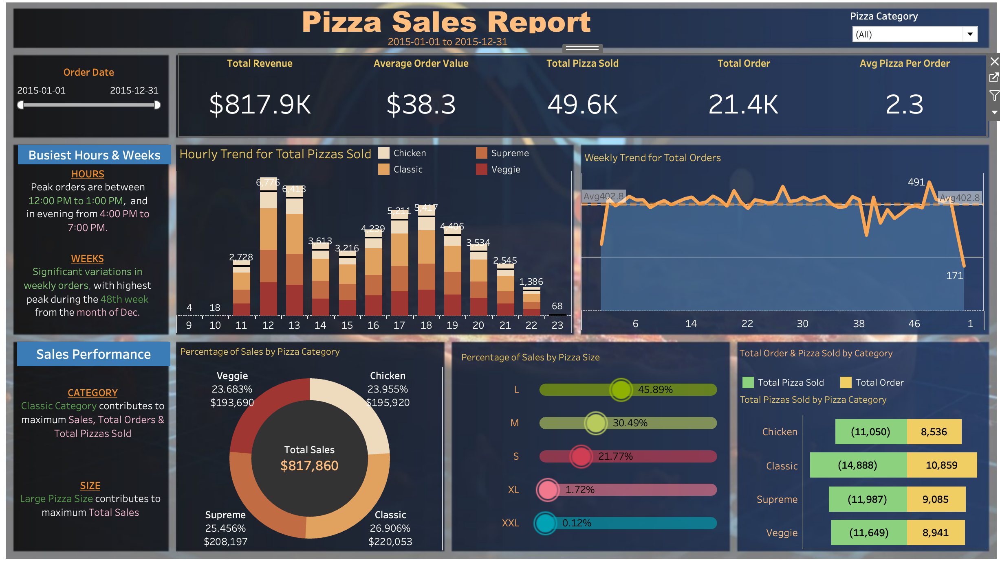

# 🍕 Pizza Sales Report  

## Overview  
This project analyzes **pizza sales data** using **MySQL for data processing** and **Tableau for visualization**. The goal is to extract insights into **sales trends, order behavior, peak sales periods, and top-performing pizza categories** to support better decision-making.

## Dashboard Visualization  
  

## Key Questions  
1. What is the **total revenue** generated from pizza sales?  
2. What are the **busiest hours and weeks** for pizza sales?  
3. Which **pizza category** contributes the most to total sales?  
4. How does **pizza size impact revenue and order volume**?  
5. What is the **average order value** and **average number of pizzas per order**?  
6. How do sales trends vary **hourly, weekly, and by category**?  

## Dataset  
- **Database:** `PizzaDB`  
- **Table Name:** `pizza_sales`  
- **Columns Included:**  
  - `order_id` – Unique order identifier  
  - `order_date` – Date of the transaction  
  - `order_time` – Time of the order  
  - `pizza_name` – Name of the pizza  
  - `pizza_category` – Classification of pizzas (Classic, Supreme, Veggie, etc.)  
  - `pizza_size` – Available sizes (S, M, L, XL, XXL)  
  - `quantity` – Number of pizzas sold per order  
  - `total_price` – Total price of the order  

 ## 📊 Tableau Dashboard Creation  

### **Step 1: Connecting MySQL to Tableau**  
1. Open **Tableau** and go to **Connect > MySQL**.  
2. Enter the **hostname, username, password**, and select the **PizzaDB** database.  
3. Drag the **pizza_sales** table into the **Data Source** workspace.  

### **Step 2: Creating Visualizations**  

#### **Total Revenue & Order Metrics**  
- Use `SUM(total_price)` for **Total Revenue**.  
- Use `COUNT(DISTINCT order_id)` for **Total Orders**.  
- Use `SUM(total_price) / COUNT(DISTINCT order_id)` for **Avg Order Value**.  

#### **Sales Trends**  
- **Hourly Trend for Pizza Sales**:  
  - Use `HOUR(order_time)` as the **X-axis**.  
  - Use `SUM(quantity)` as the **Y-axis** (**line chart**).  

- **Weekly Trend for Orders**:  
  - Use `WEEK(order_date)` as the **X-axis**.  
  - Use `COUNT(DISTINCT order_id)` as the **Y-axis**.  

#### **Category & Size Breakdown**  
- Use **Donut Charts** for **Sales by Pizza Category**.  
- Use **Bar Charts** for **Sales by Pizza Size**.  

## 📊 Expected Outcomes  

- A **clear understanding of sales trends**, order behavior, and peak sales periods.  
- Identification of **high-performing pizza categories and sizes**.  
- Data-driven strategies to **increase average order value and optimize stock levels**.  

---

## 🔹 Recommendations  

- **Optimize store operations** during peak sales hours (**12 PM - 1 PM & 4 PM - 7 PM**).  
- **Focus on best-selling pizza sizes** (**Large pizzas contribute the most revenue**).  
- **Increase promotions** for **underperforming categories** like **XL and XXL pizzas**.  
- **Improve marketing campaigns** for the **48th week of December**, the peak sales period.  

---

## 🛠 Tools Used  

- **MySQL** – Data storage, cleaning, and analysis using SQL queries.  
- **Tableau** – Interactive visualization and dashboard creation.  
